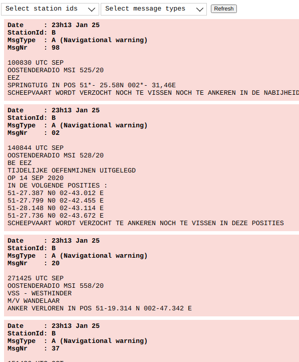

# NavTex reader for SignalK

This plugin allows you to view NavTex messages in a browser, e.g. from your phone/ipad and/or from a B&G/Navico MFD when using [this plugin](https://www.npmjs.com/package/signalk-mfd-plugin).
The plugin expects a NavTex feed on a serial port, which can be configured in the plugin config.

## NavTex support

### ZCZC
The normal ZCZC header type messages are supported

### NASA NavTex
NASA uses > and < as header and footer. This is supported as well.

## Features
 - Station and per station message type selection through plugin config
 - Day/night mode
 - Temp removing messages from view
 - Option to use NASA NavTex stored messages

